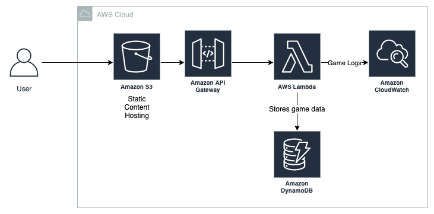

# Kalah Frontend
This repository hosts the code for the front-end of my Kalah game implementation. It communicates with its back-end counterpart, available at https://github.com/pedro-rates/kalah-backend

This project was generated with [Angular CLI](https://github.com/angular/angular-cli) version 12.0.2.

## Development server

Run `ng serve` for a dev server. Navigate to `http://localhost:4200/`. The app will automatically reload if you change any of the source files.

## Build

Run `ng build` to build the project. The build artifacts will be stored in the `dist/` directory.

## Architecture
